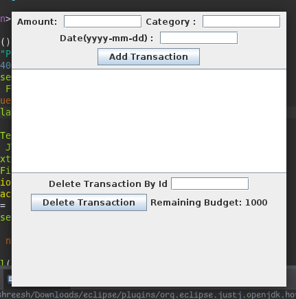
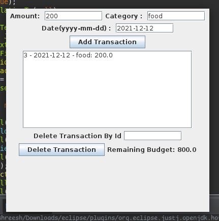
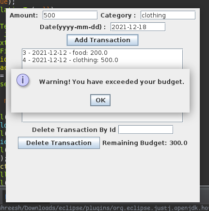

# Personal Finance Manager

## Project Overview

The Personal Finance Manager application allows users to manage their personal finances by adding, viewing, and deleting transactions while monitoring their budget. The application is built using core Java concepts, including Swing for the GUI, and ensures persistence through file storage.

### Features

- **Add Transaction**: Input transaction details (amount, category, date).
- **View Transactions**: Display transactions with ID, date, category, amount.
- **Delete Transaction**: Remove transactions by ID.
- **Budget Monitoring**: Tracks budget and shows warnings when exceeded.
- **File Storage**: Saves transactions in `transaction.txt` for persistence.

### Learning Outcomes

- **File Handling**: Learned data storage and retrieval from files.
- **Java Swing**: Built GUI with Swing.
- **Event-Driven Programming**: Handled user actions with event listeners.
- **Object-Oriented Programming**: Applied OOP principles in design.
- **List Management**: Managed transaction data using lists.

---

## How to Run

1. Clone this repository to your local machine.

```bash
git clone git@github.com:GosuCode/Personal-Finance-Manager.git
```

2. Open the project in your IDE.
3. Run the `Main` class:

## Screenshots

### Add Transaction Screen



### Transaction List Screen



### Warning upon full exceeding budget



---

## Future Enhancements

- Implement category-based budgeting and monthly budgeting features.
- Improve data storage with a database instead of text files for better scalability.
- Enhance the user interface by adding features like transaction editing and sorting.
- Continuously improve and add features based on what I learn along the way.

## Contributing

Feel free to fork the repository and submit pull requests. Contributions are welcome!
